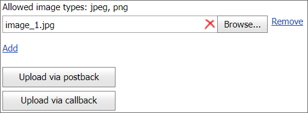

<!-- default badges list -->

[](https://supportcenter.devexpress.com/ticket/details/E3067)
[](https://docs.devexpress.com/GeneralInformation/403183)
<!-- default badges end -->
# Upload Control for ASP.NET Web Forms - How to save uploaded files on the server
<!-- run online -->
**[[Run Online]](https://codecentral.devexpress.com/e3067/)**
<!-- run online end -->

This example demonstrates how to upload files on a callback and postback and handle the upload control's `FilesUploadComplete` event to save the files on the server.



## Overview

Create the [Upload control](https://docs.devexpress.com/AspNet/DevExpress.Web.ASPxUploadControl) and add two buttons to the page. To upload files on a callback or postback, enable or disable the buttons' [AutoPostBack](https://docs.devexpress.com/AspNet/DevExpress.Web.ASPxButton.AutoPostBack) properties. When a user selects a file and clicks a button, the selected file is uploaded to the server.

To save the file to a specific location on the server, handle the upload control's [FilesUploadComplete](https://docs.devexpress.com/AspNet/DevExpress.Web.ASPxUploadControl.FileUploadComplete) event and specify the file's name and path in the handler.

```cs
protected void ASPxUploadControl1_FilesUploadComplete(object sender, DevExpress.Web.FilesUploadCompleteEventArgs e) {
    // ...
    ASPxUploadControl uploadControl = sender as ASPxUploadControl;
    if (uploadControl.UploadedFiles != null && uploadControl.UploadedFiles.Length > 0) {
        for (int i = 0; i < uploadControl.UploadedFiles.Length; i++) {
            UploadedFile file = uploadControl.UploadedFiles[i];
            if (file.FileName != "") {
                string fileName = string.Format("{0}{1}", MapPath("~/Images/"), file.FileName);
            }
        }
    }
}
```

## Files to Review

* [Default.aspx](./CS/WebSite/Default.aspx) (VB: [Default.aspx](./VB/WebSite/Default.aspx))
* [Default.aspx.cs](./CS/WebSite/Default.aspx.cs) (VB: [Default.aspx.vb](./VB/WebSite/Default.aspx.vb))
